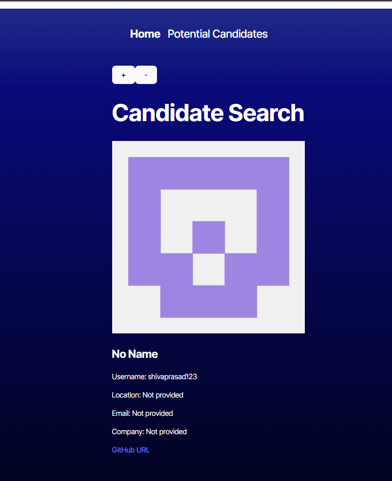

# K-Candidate-Search
  
  ## Description
  This candidate search application is made to look for candidates that you may find on github. The candidates that is shown to the users will be randomized and the users can choose whether or not to save their profile into the saved candidates page. Informations about the candidates will include their profile picture or avatar, name, username, email, location, and company if the candidates have added those information to their profile. If not, then the candidate may only provide users with only their username and github profile. 
  ## Table of Contents
  * [Installation](#installation)
  * [Usage](#usage)
  * [Credits](#credits)
  * [License](#license)
  * [Badges](#badges)
  * [Features](#features)
  * [How to Contribute](#howToContribute)
  * [Test](#test)
  ## Installation
  This application will be deployed on Netlify. You can access the application through this URL: " ". If you would like to see the code, you can go to https://github.com/kaneganteng/K-Candidate-Search and you can try making changes by doing a git clone on your terminal.
  ## Usage
  Once user go the deployment link, user can either add a candidate to the "Potential Candidates" by clicking on the "+" or clicking on the "-" to skip the candidate. The home page of this application will look like this:  
  ## Credits
  N/A
  ## License
  MIT 
  ## Badges
  N/A
  ## Features
  * React + TypeScript
  * Vite
  * GitHub token
  ## How to Contribute
  You can reach out to me by using the contact information at the end of this README.md
  ## Questions
  Contact:
  * Name: Kane Esasta
  * Email: kaneesasta@gmail.com
  * Github: [kaneganteng](https://github.com/kaneganteng)